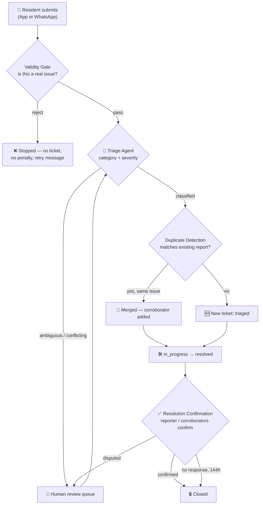

# 🏘️ MyZone

### AI-powered civic issue reporting for residential communities

*Report it on WhatsApp. Track it like a delivery. Watch it actually get fixed.*

`spec-complete` · `single-tenant` · `App + WhatsApp` · `LLM-powered classification`

---

## The Problem

Potholes get reported in a WhatsApp group and forgotten in twelve hours. Streetlight complaints live in someone's notes app. No one knows if the leak from last month ever got fixed, and the one resident who *does* follow up has to do it from memory.

MyZone turns that into a system: every report gets a ticket, every ticket gets classified automatically, every resolution gets confirmed by a real human before it's marked done — and an elderly resident with no app can report the same way, over WhatsApp, with their voice.

---

## What It Does

```
 📸 Resident reports issue        🤖 AI classifies & routes        ✅ Resolution confirmed
 (App or WhatsApp)         ──►    (category, severity,      ──►   (by the actual reporter,
                                   department, in seconds)          not just admin say-so)
```

| | |
|---|---|
| 🗣️ **Report by voice** | Elderly residents speak a voice note on WhatsApp — it's transcribed and triaged exactly like an app submission |
| 🧠 **AI does the classifying** | A two-stage AI pipeline checks "is this even a real issue?" then sorts it into category, severity, and the right department — no human has to read every ticket |
| 🔁 **Duplicate-aware** | Five people reporting the same pothole strengthens one ticket instead of cluttering five |
| ✅ **Trust, but verify** | A report isn't "closed" because an admin says so — the resident (or a neighbor who also flagged it) has to confirm it's actually fixed |
| 📊 **Dashboards that mean something** | Admins see SLA breaches by zone at a glance; residents see how their block is doing this month |
| 🏅 **Gamified participation** | Badges reward residents who report, follow through, and verify — civic engagement that feels like progress, not paperwork |
| 📣 **One-way advisories** | Admins broadcast "water shutoff 10am–2pm" straight to the affected block, on whichever channel each resident actually uses |

---

## Why It's Different

**Most civic-reporting tools stop at "ticket created."** MyZone is built around a harder truth: a complaint isn't resolved when an admin clicks a button — it's resolved when the person who filed it says so.

- **Confirmation loop, not a checkbox.** Every resolution gets a real confirm-or-dispute cycle with a bounded fallback chain — nothing sits open forever, and nothing gets marked fixed without a chance to push back.
- **One identity, two channels.** Phone-number auth means the same person is the same `user_id` whether they're in the app or texting WhatsApp — no separate accounts, no re-onboarding.
- **Humans stay in the loop where it matters.** Ambiguous, conflicting, or politically sensitive reports don't get force-classified by AI guesswork — they route straight to a human review queue.
- **Built small on purpose.** Single-tenant, one society, no premature multi-tenancy complexity, no configurable rules engines where a hardcoded rule does the job. Every feature spec explicitly states what it *won't* build, so scope creep gets caught at design time, not three sprints in.

---

## How a Report Travels Through the System



---

## Tech Shape

| Layer | What it needs |
|---|---|
| **Identity** | Phone number + OTP, shared across app and WhatsApp |
| **AI** | Multimodal LLM (image + text in, structured JSON out) — two calls per submission |
| **Messaging** | WhatsApp Business API (send + receive) — the single highest-risk external dependency |
| **Storage** | S3-compatible object storage, signed URLs, 90-day media retention |
| **Database** | Relational — every feature here is relationally linked, not document-isolated |
| **Notifications** | Push (app) + WhatsApp template messages, fire-and-forget except confirmation flows |

No vendor is prescribed — every decision above is a *capability* requirement, picked at build time based on whatever stack is in use.

---

## Project Scope at a Glance

```
✅  Single housing society / residential complex (single-tenant)
✅  App + WhatsApp, same identity, same pipeline
✅  AI classification with a human-review safety net
✅  Resolution confirmed by the people who actually filed the report
✅  Read-only dashboards — no new logic, just visibility

🚫  Multi-society / multi-tenant (deliberately deferred)
🚫  Configurable rules engines, badge editors, approval workflows
🚫  Map-based clustering, history timelines, scheduled broadcasts
```

---

**📄 See [`FEATURES.md`](./FEATURES.md) for the full feature-by-feature breakdown.**

*A complaint shouldn't disappear into a group chat. It should have a ticket number.*
