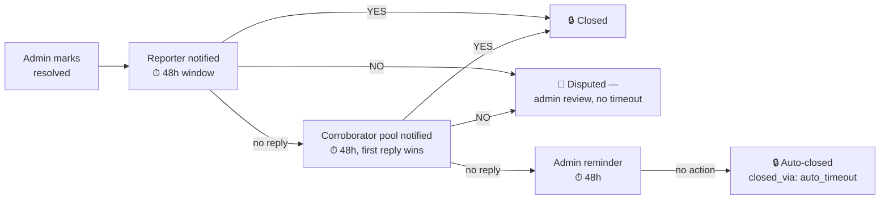

# 📋 MyZone — Feature Breakdown

*Nine specs, one pipeline. Here's every piece, what it owns, and what it deliberately doesn't do.*

`9 features` · `1 shared report schema`

---

## 🗺️ The Pipeline

Every report is **one record**, enriched as it moves left to right. No feature duplicates the schema — each owns specific fields on it.

```
 Capture → Validity Gate → Triage Agent → Duplicate Detection → Status/Tracking → Resolution Confirmation
                                                                        ↓
                                                    Dashboards · Gamification · Broadcasts (read-only / isolated)
```

---

## 🧱 0. Platform Foundations

**The plumbing every other feature assumes exists.**

| Decision | What it locks in |
|---|---|
| **Tenancy** | Single-tenant — one deployment = one housing society. No `society_id` field. "Ward" = block/wing within the society. |
| **Identity** | Phone number + OTP. One `user_id` works identically across app and WhatsApp — no account linking. |
| **Routing** | Static `departments` table mapping Triage Agent category → admin `user_id`s. 2–4 departments, no permissions system. |
| **Storage** | 5 MB/photo, 3 photos max, JPEG/PNG/WebP. Voice notes transcribed then discarded. Media purged 90 days after `closed`; ticket JSON kept forever. |
| **AI calls** | Two structured-JSON LLM calls per submission: Validity Gate (cheap) → Triage Agent (heavy). Vendor-agnostic by design. |
| **Notifications** | Push + in-app inbox (app), WhatsApp messaging API (WhatsApp). Fire-and-forget except Resolution Confirmation. |

**Why it matters:** every other feature in this doc references identity, routing, storage, or AI calls without defining them. This is where those get decided once.

---

## 1️⃣ Submission Validity Gate

> *Runs first, on every submission, every channel. One question: "is this even a real civic issue?"*

| | |
|---|---|
| 🎯 **Job** | Cheap pre-filter before the expensive Triage Agent call runs |
| 🚦 **Three bands** | `reject` (<0.3) → stopped, no ticket • `uncertain` (0.3–0.7) → passes through, flagged • `valid` (>0.7) → passes through clean |
| 🛡️ **No-fault by design** | Rejects and uncertain flags **never** hurt a user's trust score — the gate is probabilistic and imperfect, so it doesn't punish users for its own mistakes |
| ❌ **What it doesn't do** | Doesn't classify category/severity, doesn't duplicate the Triage Agent's "insufficient info" or "novel issue" logic, doesn't rate-limit repeat rejects (that's a future trust-scoring concern) |

---

## 2️⃣ Triage Agent — *the classification core*

> *Every report that passes the gate gets a category, a severity, and a confidence score — in seconds, not in someone's inbox.*

**Step 1 — Input state**

| State | Meaning |
|---|---|
| **A** | Photo + text agree → classify normally |
| **B** | Photo + text *conflict* → straight to human review, tagged with conflict type |
| **C** | Text only → classify with a confidence penalty on severity |
| **D** | Photo only → classify with a confidence penalty on severity |

**Step 2 — Six triggers that route to human review (`Category 6`)**

```
T1 Ambiguous       T2 Insufficient info     T3 Novel/unrecognized
T4 Conflicting      T5 High-stakes (legal,    T6 Low confidence on
   /compound           political, disputes)      both axes
```

**Step 3 — Category × severity matrix** *(only if no trigger fired)*

| # | Category | Low example | High example |
|---|---|---|---|
| 1 | Roads, Transport & Infrastructure | Faded lane markings | Major road cave-in |
| 2 | Water, Drainage & Sanitation | Minor seepage | Sewage overflow |
| 3 | Electricity & Power | Flickering streetlight | Exposed live wires |
| 4 | Public Safety, Health & Environment | Minor litter | Gas leak / fire hazard |
| 5 | Encroachments & Civic Violations | Minor hawker presence | Illegal land grabbing |

> 🧑‍⚖️ **Category 6 isn't a severity tier** — it's a human-review fallback. Once an admin clarifies it, the report re-enters Step 3 with that clarification as new evidence.

---

## 3️⃣ WhatsApp Reporting Channel

> *For residents who can't or won't use an app — primarily elderly users. Fixed script. No AI conversation, no NLU.*

```
👋 Welcome  →  📸 Send a photo  →  💬 Describe it (type or voice)  →  📍 Share location  →  🎫 Ticket #1234
```

| | |
|---|---|
| 🎙️ **Voice notes** | Always transcribed before becoming the report's text — never manually reviewed as raw audio. Failed transcription loops back with a retry prompt, never advances on bad data. |
| 🚫 **Off-script anything** | Same fixed help menu every time: `START` / `STATUS #1234` / `HELP`. No retry-counting, no escalation logic, no attempt to interpret intent. |
| 📍 **Location fallback** | No GPS share? User types a landmark instead — passed straight into the Triage Agent's existing low-accuracy handling, not pre-filtered here. |

---

## 4️⃣ Duplicate Detection & Report Persistence

> *Five neighbors reporting the same pothole shouldn't create five tickets — but each one should count.*

**Two distinct actions, never confused:**

| Action | Trigger | Effect |
|---|---|---|
| 🔗 **Duplicate match** | New report scores ≥ threshold against an open report nearby | `report_count += 1`, corroborator added — **no re-classification** |
| 📈 **Persistence / worsening** | User taps "Still here / Getting worse" on an *existing* report, optionally with new evidence | If new evidence attached → re-triage; severity changes **append** to `severity_history`, never overwrite |

> Every match above threshold is shown to the user for confirmation — there is no silent auto-merge at any confidence level.

---

## 5️⃣ Resolution Confirmation

> *An admin saying "fixed" isn't the same as it being fixed. This is the trust layer.*



| | |
|---|---|
| ⏱️ **Bounded, always** | 48h reporter + 48h corroborators + 48h admin = max **144 hours** to auto-close. Nothing hangs open forever. |
| 🚩 **The one exception** | A `disputed` flag has **no timeout** by design — a genuine "it's still broken" claim shouldn't be steamrolled by a clock. |
| 👥 **Who can confirm** | Only the original reporter or that specific report's corroborators — never a random nearby resident. |

---

## 6️⃣ Public Case Tracker

> *One field — `status` — six states, one screen, no surprises.*

```
submitted → triaged → in_progress → resolved → closed
                                          ↑          ↓
                                          └─ reopened ┘
```

| | |
|---|---|
| 🔒 **Locked list** | Exactly six states. No feature may introduce a seventh. |
| 🏷️ **Plain labels** | `"Submitted — awaiting review"`, `"Work in progress"`, `"Marked resolved — confirm it's fixed"`, etc. — no per-category variants. |
| 📱 **Cross-channel lookup** | One shared query powers both the app screen and the WhatsApp `STATUS #1234` command. |
| 🔔 **One notification per transition** | No batching, no digests — sent on whichever channel the user originally reported on. |

---

## 7️⃣ Dashboards & Gamification

> *Three read-only views. Zero new logic. They render what the pipeline already produced.*

### 🛠️ Authority Dashboard *(internal)*

SLA = base days × severity multiplier, computed live — never stored (it'd go stale).

| Category | Base SLA |
|---|---|
| Roads | 7d |
| Water | 2d |
| Power | 3d |
| Safety | 3d |
| Encroachment | 14d |

Binary 🔴 red / not-red. Sortable table by ward — no map.

### 📊 Community Impact *(citizen-facing)*

```
Ward 4 this month:
14 reported
9 resolved
5 open
```

That's the entire feature. No charts, no trends — deliberately the lowest-priority build.

### 🏅 Gamification

| Badge | Trigger |
|---|---|
| 🥇 First Report | 1 report filed |
| 🌟 5 Reports | 5 total |
| ✅ Verified Resolver | Own report closed, user-confirmed |
| 🔁 Persistent Reporter | Corroborated 3+ reports |

Four badges, hardcoded — no badge editor.

---

## 8️⃣ Utility / Advisory Broadcasts

> *A human writes a message, picks a ward, sends it. The simplest feature in the system, on purpose.*

| | |
|---|---|
| ✍️ **Compose** | Message text + one of 3 categories (`utility` / `safety` / `general`) + target ward(s) |
| 📤 **Send** | Immediate only — no scheduling, no drafts, no edit-after-send |
| 📡 **Delivery** | One-way push (in-app + WhatsApp). No read receipts, no reply-handling |
| 🚫 **Explicitly not built** | No auto-generated broadcasts from report clusters, no multi-admin approval — both flagged as separate future features with their own guardrails |

This feature is fully isolated: its own record type, reads nothing from and writes nothing to the report schema.

---

## 🔗 Cross-Reference — Who Owns What

| Field(s) | Written by | Read by |
|---|---|---|
| `validity_score`, `validity_band` | Validity Gate | Triage Agent |
| `category`, `severity`, `input_state` | Triage Agent only (incl. re-triage) | Almost everything downstream |
| `report_count`, `corroborators` | Duplicate Detection only | Resolution Confirmation, Gamification |
| `severity_history` | Duplicate Detection (re-triage) | Dashboards |
| `status`, `status_updated_at` | Validity Gate / Triage Agent / Admin / Resolution Confirmation | Everything |
| `resolution_flag`, `closed_via` | Resolution Confirmation | Tracker, Gamification |
| `broadcast_id` record | Broadcasts | Nothing — fully isolated |

---

## 🚫 Deliberately Out of Scope

Named explicitly in the specs to prevent silent scope creep later:

- Multi-society / multi-tenant support
- Auto-generated broadcasts from report patterns
- Configurable badge or rules engine
- Map-based clustering visualization
- Amber/warning SLA tier
- Timeline/history UI on the tracker
- Notification batching or digesting
- Email/password auth alongside phone-OTP
- Per-department permission tiers
- Manual per-ticket reassignment UI

---

**📄 Back to [`README.md`](./README.md) for the project overview.**
